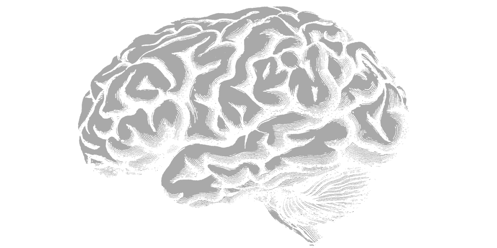

# Grey Matters

## Goal

The goal of Grey Matters is to master theoretical principles by investigating differences or nuances among two or more concepts.

## State

Newborn.

## Decks

- [Regression versus Machine learning](Regression_vs_Machine_Learning/slides/)
