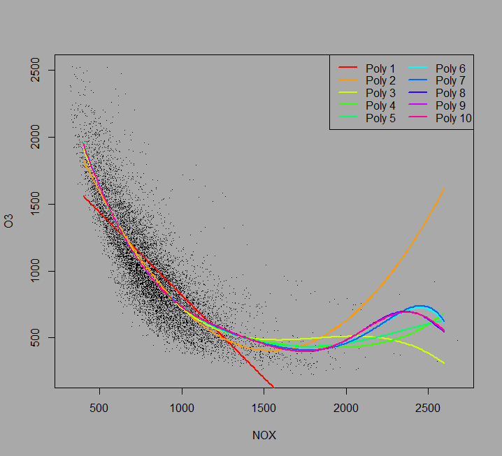
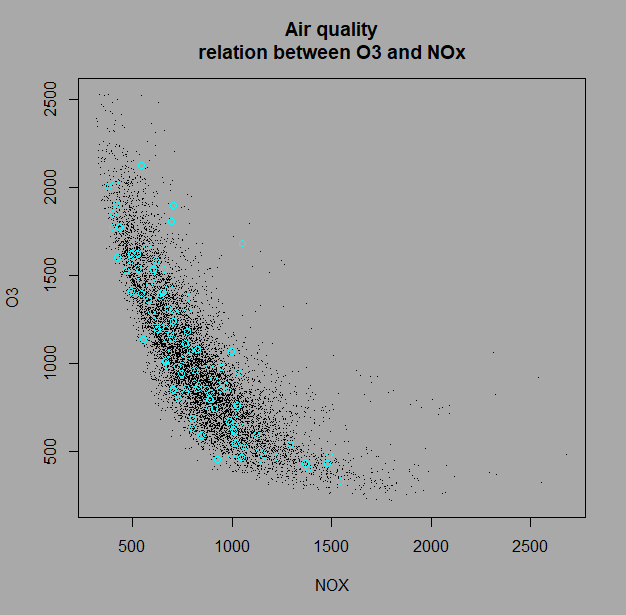
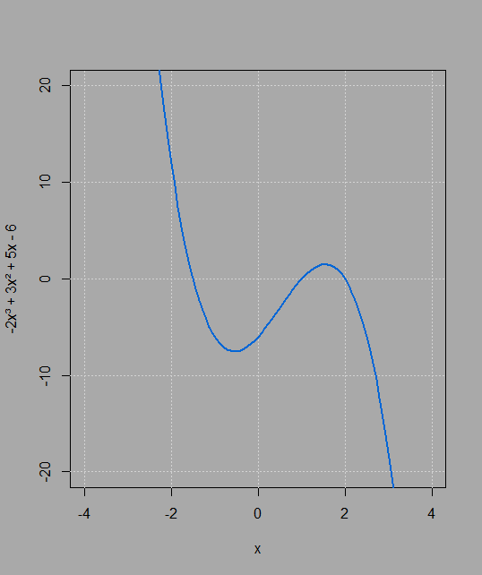
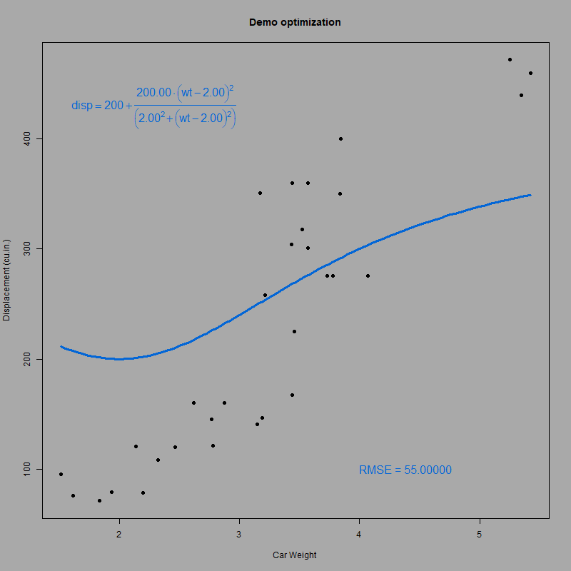
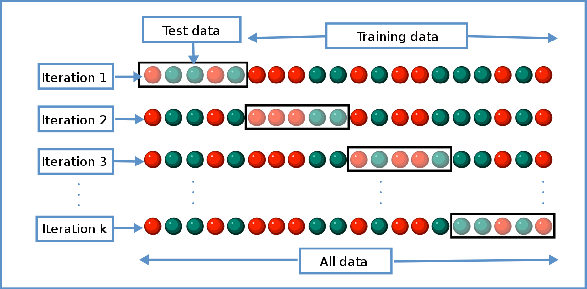
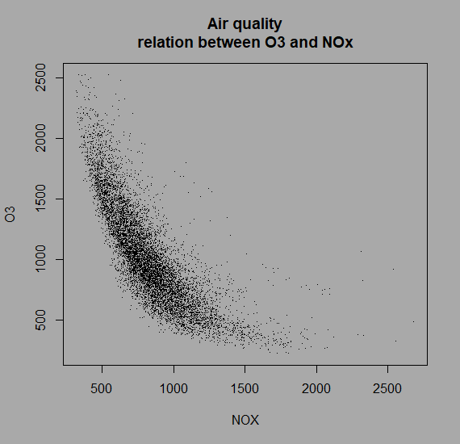
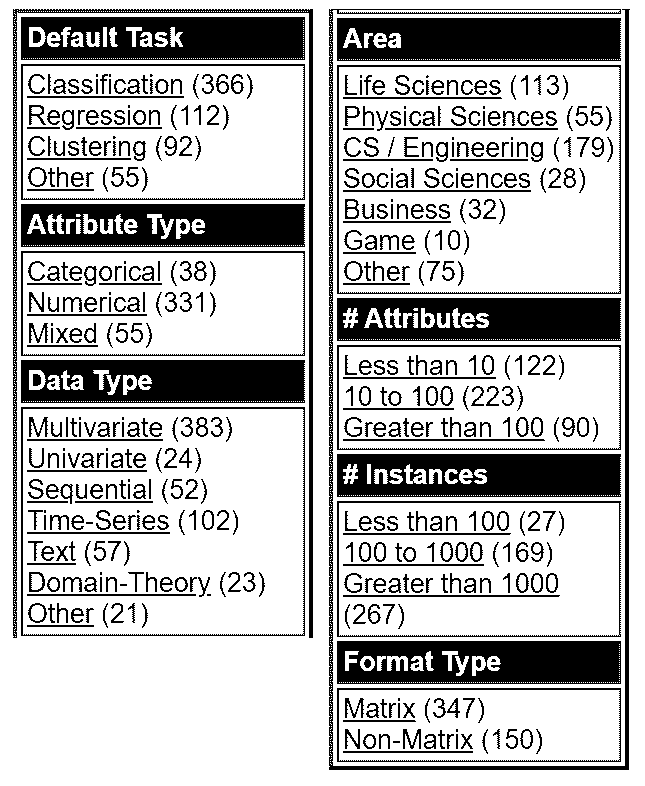
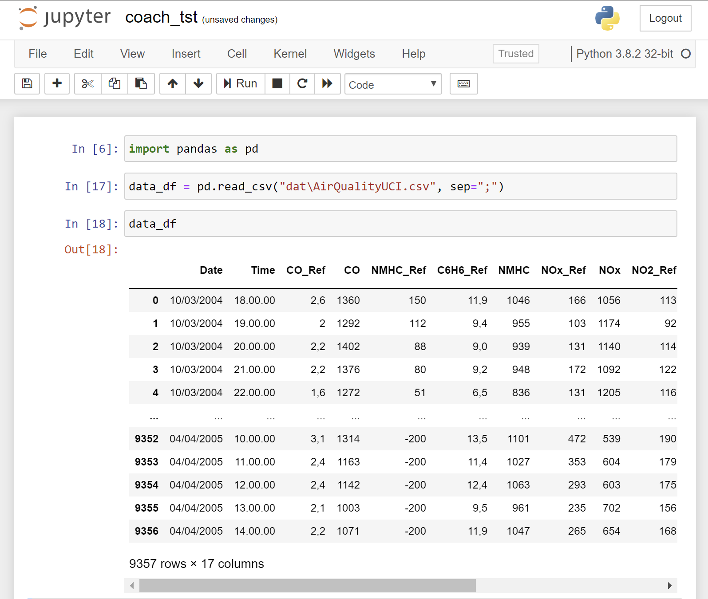

<!-- backgroundColor: darkgrey -->
<!-- headingDivider: 2 -->
<!-- paginate: true -->

<style> 
h1 {
    color:black;
}

h2 {
    margin-bottom: 50px;
}

section table{
    table-layout: fixed;
    width:100%;
    display: table;
    border: 0;
}

table {
    margin-bottom: 50px;
}

section table th, section table td, thead tr, tbody tr {
    background-color: darkgrey;
    border: 0;
    font-size: 30px;
    text-align: center;
}

.term {
    border-bottom: 1px dotted #000;
}

details {
    font-size: .8em;
}

summary {
    font-size: 1.4em;
}

details[open] summary ~ * {
  animation: sweep .5s ease-in-out;
}

pre {
    background-color: #A1A2A2;
    border: 0;
}

@keyframes sweep {
  0%    {opacity: 0; margin-left: -10px}
  100%  {opacity: 1; margin-left: 0px}
}
</style>

# Demonstrate the difference between regression and machine learning in Python


David D'Haese

## Goal of grey matters

To master theoretical principles by investigating differences or nuances among two or more concepts.

## Goal of this slide deck

- To learn _AI principles_ by investigating similarities and differences of regression versus machnine learning.
- To teach AI programming skills using _Python_ as a programming language
- To stimulate students to _make their own investigations_ instead of only relying on given information

## About this slide deck

Next, you will encounter a quiz. The quiz is like a maze. The start and the end are the same for everyone that completes the quiz, but the journey may differ depending on your skills and background.

> This quiz is set up as a series of slides. If you take the wrong turn, you will get lost in the maze. You will see that links, buttons and collapsible panes will guide you through the maze. Make sure to follow the instructions.

## Good luck!

## Regression or machine learning I

Here, we plotted all [O<sub>3</sub>](https://en.wikipedia.org/wiki/Tropospheric_ozone) against [NO<sub>x</sub>](https://en.wikipedia.org/wiki/NOx) values and we tried to fit the <span class='term' title='No not thé cloud, cloud as in fluffy aggregation of points'>cloud</span> with <span class='term' title='Models like y=ax+b (first degree) or y=ax²+bx+c (second degree), ...'>polynomials</span> of varying degrees to learn wich one fits best. What is this an example of? (_pick one_)

<details><summary>Regression</summary>
</img>
<span style="color:green">Correct. What we actually do here is describing the data with predefined hypotheses.</span>
</details>

<details><summary>Machine learning</summary>
</img>
<span style="color:#DD0000">We do not learn anything. We know in advance that the more complex the model is (i.e. the higher the degree of the polynomial), the better the fit will be.</span>
</details>



## Regression or machine learning II

Same data, but this time we randomly held out some data and somehow <span class='term' title='Some black box calculation for now, see later'>calculated</span> how well we can __predict__ O<sub>3</sub> given __new__ NO<sub>x</sub> data. What is this an example of?

<details><summary>Machine learning</summary>
</img>
<span style="color:green">We do not simply describe this data set, we try to predict future data originating from the same process.</span>
</details>

<details><summary>Regression</summary>
</img>
<span style="color:#944E1F">Sort of. The algorithm is indeed a regression algorithm, but in order to make sure you can make predictions, you need more, that is what <span class='term' title='Machine learning'>ML</span> can offer.</span>
</details>



## The difference

> __Regression__ is for __looking backward__, fitting a predetermined model to existing data

> __Machine learning__ is for __looking forward__, predicting future data

## Competition

You might argue that one can also do predictions with regression only. True, but the predictions using Machine learning are more accurate, and this is what  we will prove using Python.

## Many terms

In dutch, the word for polynomials is '_veeltermen_' which literally translates to '_many terms_'. And that is exactly what we will be introducing here. Click on the terms below to view their definitions.

|                    |                |                      |
| ------------------ | -------------- | -------------------- |
| [Polynomials](#11) | [Fitting](#13) | [Randomization](#14) |

<span style='float:right'>[I'm ready, continue →](#15)</span>

## Polynomials (I)

Are mathematical functions that fit in the following _type of_ series:

| Degree        | Formula                            |
| ------------- | ---------------------------------- |
| 0 (constant)  | $-6$                               |
| 1 (linear)    | $5x – 6$                           |
| 2 (quadratic) | $3x^{2} + 5x – 6$                  |
| 3 (cubic)     | $-2x^{3} + 3x^{2} + 5x – 6$        |
| 4 (quartic)   | $x^{4} – 2x^{3} + 3x^{2} + 5x – 6$ |  |
| […]           |                                    |

<span style='float:right'>[Next](#12)</span>

## Polynomials (II)



-6 ● 5x – 6 ● 3x^{2} + 5x – 6 ● -2x^{3} + 3x^{2} + 5x – 6 ● x^{4} – 2x^{3} + 3x^{2} + 5x – 6

Go to [this online calculator](https://www.symbolab.com/solver/polynomial-equation-calculator/) and check which degree this polynomial has (_paste the above functions in the texbox of the online calculator and enjoy_):

<details><summary>Answer</summary>

This polynomial of third degree.

</details><br>

[← go back](#10)

## Fitting

Or more accurately _optimisation_ is the action of adapting the model parameters such that the differences between the expected values and actual values are as low as possible. These so-called _error-values_ are being determined here by way of the <span class='term' title='Root mean square error'>RMSE</span>.



[← go back](#10)

## Randomization

Is the splitting of a data set into a __training__ and a __test__ subset. A special case is the case of __cross-validation__ (see left), where the <span class='term' title='Generally the rows in a flat data set, also called the observations or the examples'>instances</span> are divided in groups that in turn have to serve as test set. Mind that any randomization is always being preceded by a random shuffle of the instances.

[← go back](#10)



## Order of events

Select a correct and most complete scenario during a ML analysis (_click on the correct letter_):

[_a_.](#16) Load data 🢥 Training 🢥 Testing 🢥 Conclusion
[_b_.](#16) Load data 🢥 Training 🢥 Randomize 🢥 Testing 🢥 Model 🢥 Score
[_c_.](#17) Load data 🢥 Randomize 🢥 Training 🢥 Testing 🢥 Score 🢥 Conclusion
[_d_.](#16) Load data 🢥 Training 🢥 Score 🢥 Randomize 🢥 Conclusion
[_e_.](#16) Load data 🢥 Randomize 🢥 Model 🢥 Training 🢥 Testing 🢥 Score 🢥 Conclusion

## Wrong order of events

_a_. ~~Load data 🢥 Training 🢥 Testing 🢥 Conclusion~~
_b_. ~~Load data 🢥 Training 🢥 Randomize 🢥 Testing 🢥 Model 🢥 Score~~
_c_. Load data 🢥 Randomize 🢥 Training 🢥 Testing 🢥 Score 🢥 Conclusion
_d_. ~~Load data 🢥 Training 🢥 Score 🢥 Randomize 🢥 Conclusion~~
_e_. ~~Load data 🢥 Randomize 🢥 Model 🢥 Training 🢥 Testing 🢥 Score 🢥 Conclusion~~

Unfortunately, you picked the wrong order. You cannot have a randomization after the training because for ML, you generally need to train on the training set, which is the result of the randomization. Also, you cannot have a trained model before you started any training. So _c._ is the only option left. [Revisit the many terms](#10) or [go back](#15)


## Right order of events

_a_. ~~Load data 🢥 Training 🢥 Testing 🢥 Conclusion~~
_b_. ~~Load data 🢥 Training 🢥 Randomize 🢥 Testing 🢥 Model 🢥 Score~~
_c_. Load data 🢥 Randomize 🢥 Training 🢥 Testing 🢥 Score 🢥 Conclusion
_d_. ~~Load data 🢥 Training 🢥 Score 🢥 Randomize 🢥 Conclusion~~
_e_. ~~Load data 🢥 Randomize 🢥 Model 🢥 Training 🢥 Testing 🢥 Score 🢥 Conclusion~~

Congratulations if you picked this order the first time right. So let us now start loading some data.


## Finding the right data

To demonstrate the difference between _regression_ and _machine learning_, we will need to find a data set that allows for a scatter plot to be drawn. What types of variables do we need for this?

[_a_.](#19) Two continuous-scale variables
[_b_.](#19) Two nominal-scale variables
[_c_.](#19) A mixture of both
[_d_.](#20) A continuous scale _outcome variable_ and a continuous scale _feature_
[_e_.](#19) It doesn't really matter



## Wrong variable types

Unfortunately, you picked the wrong choice. You cannot have a scatter plot with nominal scale variables (also called categorical variables). Also, for a regression (and therefore also for a <span class='term' title='A machine learning class or `learner` that uses an algorithm that is based on regression'>regressor</span>), we need to distinguish between the <span class='term' title='Those variables that are thought to depend on others'>target or outcome variable</span> and the <span class='term' title='Those variables that are believed to explain the outcome variable'>features</span>.

[← go back](#18)


## Right variable types

Correct, for a regression (and therefore also for a <span class='term' title='A machine learning class or `learner` that uses an algorithm that is based on regression'>regressor</span>), we need to distinguish between a continuous scale <span class='term' title='Those variables that are thought to depend on others'>target or outcome variable</span> and continuous scale <span class='term' title='Those variables that are believed to explain the outcome variable'>features</span>.


## The start of a professional AI project

Before you start working on the data, in general during a professional project, there are a number of things that need to be done. Put them in the most ideal order.

<section style="font-size:.8em;">

<details><summary>Analyse problem — Assemble team — Define life cycle — Collect data — Define criteria</summary>

<span style='color:#DD0000'></span>
</details>

<details><summary>Analyse problem — Assemble team — Define life cycle — Define criteria — Collect data</summary>

<span style='color:#DD0000'></span>
</details>

<details><summary>Assemble team — Analyse problem — Define criteria — Define life cycle — Collect data</summary>

<span style='color:green'></span>
</details>

<details><summary>Assemble team — Define life cycle — Analyse problem — Define criteria — Collect data</summary>

<span style='color:#DD0000'></span>
</details>

</section>

## UCI

Where to find data? There are [h.](https://www.dataquest.io/blog/free-datasets-for-projects/)[u.](https://www.quantopian.com/)[n.](https://www.wunderground.com/weather/api/)[d.](https://vincentarelbundock.github.io/Rdatasets/datasets.html)[r.](https://data.fivethirtyeight.com/)[e.](https://www.quandl.com/search)[d.](https://www.kaggle.com)[s.](https://academictorrents.com/browse.php) [o.](https://data.world/)[f.](https://www.reddit.com/r/datasets/) sources, but one that is interesting for young AI experts is the [UCI Machine Learning Repository](http://mlr.cs.umass.edu/ml/).


Why? Because of its advanced filtering capabilities (see _left_).



## Which UCI Data set

Which of the data sets below do we need to reproduce this graph?

(_Check the [website](http://archive.ics.uci.edu/ml/datasets.php) first and then choose the right answer_)

<details><summary>Air Quality Data Set</summary>
</img>
<span style="color:green">Correct! <a href="https://archive.ics.uci.edu/ml/datasets/Air+Quality">Visit it</a>.</span>
</details>

<details><summary>Ozone Level Detection Data Set</summary>
</img>
<span style="color:#DD0000">Wrong!</span>
</details>


## Downloading the data

Now you have identified the [correct UCI data set](https://archive.ics.uci.edu/ml/datasets/Air+quality), you can download it by looking for the link named 'Data folder' at the top of the page. You can now download the file `AirQualityUCI.zip` and unzip it in a project folder of your choice.

It is a good practise to adopt a consistent directory structure for all your AI projects. While having a `dat` subfolder is oftentimes sufficient, in a professional environment, you'll want to separate input from output, like this:

```txt
PROJECT
├─INPUT
│  └──ORIG
├─OUTPUT
├─PROCESS
└─REPORT
```

## Data files

The data consists of two files `AirQualityUCI.csv` and `AirQualityUCI.xlsx`. Both contain the same data but presented in two different formats. As a data scientist, which one are you to use?

<details><summary><code>XLSX</code></summary>
</img>
<span style="color:#DD0000">Not that we hold anything against Microsoft, Excel has some great features that make it unique, but if you do have a choice, choose for a a more reliable text-based format. See <a href="https://datascience.stackexchange.com/questions/5443/do-data-scientists-use-excel">this article</a> if you want to understand why.</span>
</details>

<details><summary><code>CSV</code></summary>
</img>
<span style="color:#944E1F">CSV stands for _comma-separated values_ and it is more reliable than Excel files in many ways (see <a href="https://datascience.stackexchange.com/questions/5443/do-data-scientists-use-excel">this article</a>) but there is a simpler, more reliable and better alternative still: TSV or TAB, i.e. TAB delimited values. This is because <a href="https://en.wikipedia.org/wiki/Escape_character">escaping</a> comma's is more complex, oftentimes needed whenever commas reside in the values and is not always being done properly by the authors of the data, all leading to a lot of unnecessary data cleaning. In this case, it is the best of the worst.</span>
</details>

## First glance

Time to open the data file `AirQualityUCI.csv` in your preferred [text editor](https://www.slant.co/topics/12/~best-programming-text-editors) (we recommend [VS Code](https://code.visualstudio.com/)). You should see something like this appearing on your screen (_long lines truncated_):

```txt
Date;Time;CO(GT);PT08.S1(CO);NMHC(GT);C6H6(GT);PT08.S2(NMHC);[…]
10/03/2004;18.00.00;2,6;1360;150;11,9;1046;166;1056;113;1692;[…]
10/03/2004;19.00.00;2;1292;112;9,4;955;103;1174;92;1559;972;[…]
10/03/2004;20.00.00;2,2;1402;88;9,0;939;131;1140;114;1555;[…]
```

This can hardly be called human-readable but still we advise to resist the urge to open the file in Microsoft Excel or any other CSV viewer.

## A clear head

The headings of the data file should always contain the variable names. If not, you should add them yourself. If there are headings, you need to make sure they are simple and analysis-safe. Select all names that you think are _not_ analysis-safe:

<details><summary>CO(GT)</summary>

<span style='color:#DD0000'>No special characters allowed.</span>
</details>

<details><summary>Time</summary>

<span style='color:green'>Correct.</span>
</details>

<details><summary>PT08.S4(NO2)</summary>

<span style='color:#DD0000'><code>PT08.S4</code> refers to the type of sensor and is too technical. Also dots, spaces, slashes and other special characters are all to be avoided as variable names. Only underscores are allowed. So this name needs to be transformed into _NO2_.</span>
</details>

## Method for renaming variables

What is the best way to rename the variables of the data set?

<details><summary>Using an R script</summary>
</img>
<span style="color:#DD0000">Overkill! This is a one-time operation. No need to write a script in this case. When part of a regulated pipeline, then scripting is a must, but for this exercise it is not worth the trouble.</span>
</details>

<details><summary>Using an Python script</summary>
</img>
<span style="color:#DD0000">Overkill! This is a one-time operation. No need to write a script in this case. When part of a regulated pipeline, then scripting is a must, but for this exercise it is not worth the trouble.</span>
</details>

<details><summary>Just, by hand in my text editor</summary>
</img>
<span style="color:green">Correct.  For this particular exercise, it is not worth the trouble to write a script to rename the variable names. Use your <span class="term" title='Integrated Development Environment'>IDE</span> to edit the top line of your data set file.</span>
</details><br>

(_Perform the renaming before moving on to the next slide_)

## Clearing head

If you want, you can also make sure that the names are all in the same case (VS Code: `<select line>` + `F1` + `uppercase` / `lowercase` / `titlecase`).

After processing the headings, we get something like this:

```txt
Date;Time;CO_Ref;CO;NMHC_Ref;C6H6_Ref;NMHC;NOx_Ref;NOx;NO2_Ref;NO2;O3;T;RH;AH;;
```

## Clean tail

Mind that in this case there is also the need to clean the tail section of the file:

```txt
[…]
04/04/2005;13.00.00;2,1;1003;-200;9,5;961;235;702;156;1041;770;28,3;13,5;0,5139;;
04/04/2005;14.00.00;2,2;1071;-200;11,9;1047;265;654;168;1129;816;28,5;13,1;0,5028;;
;;;;;;;;;;;;;;;;
;;;;;;;;;;;;;;;;
;;;;;;;;;;;;;;;;
;;;;;;;;;;;;;;;;
;;;;;;;;;;;;;;;;
;;;;;;;;;;;;;;;;
[…]
```

Remove these empty lines manually. You can now continue to the installation instructions for VS Code, Python, pip and Jupyter Notebooks or you can [skip those altogether](#35).

## Installing Python and Jupyter Notebooks

Procedure (_skip if you already have these_):

<details><summary>Install <a href="https://code.visualstudio.com/download">VS Code</a></summary></details>

<details><summary>Install <a href="https://www.python.org/downloads/">Python</a></summary>

  - Make sure to set check the 'set Path' option during installation or [set the path manually](https://www.windows-commandline.com/set-path-command-line/)
  - Open VS Code and open a console with `F1` + `Toggle Terminal` (remember shortcut)
  - Check the Python version using the `python --version` command
  - Install `Python Extension Pack` and `Python` extensions and read [these](https://code.visualstudio.com/docs/languages/python) guidelines

</details>

<details><summary>Install <a href="https://pip.pypa.io/en/stable/">pip</a></summary>

  - Follow the instructions in the link
  - Check the pip version using `pip --version`

</details>

<details><summary>Install <a href="https://jupyter.org/">Jupyter</a></summary>

  - with the command `pip install jupyter`
  - Afterwards check the Jupyter version with the command `jupyter --version`

</details>

## You had me at 'hello'

## New Jupyter Notebook

Procedure:

- Open your IDE ans set the current workspace to your project folder
- Open [Jupyter](https://jupyter.org/) with the console command `jupyter notebook`
- Create a new Notebook

## Importing `pandas`

[`pandas`](https://pandas.pydata.org/) contains a popular set of data science modules. Let us load it:

```python
import pandas as pd
```

What are correct assertions:

<details><summary>This statement serves to import a Python module that is <u>not</u> part of the standard library</summary>

<span style='color:green'>True, some modules are standard but pandas is not.</span>
</details>

<details><summary>The part <code>as pd</code> is compulsory</summary>

<span style='color:#944E1F'>Well, you can do without, but its bad practise to leave it out. The `as` statement defines an <span class='term' title='A new name that is simpler and/or avoids conflict with other variables in the same scope or namespace'>alias</span>. Since everyone uses it this way, it would be foolish not to do the same.</span>
</details>

## Running code

```python
import pandas as pd
```

Run the above statement, the first time, you will get an error exactly because it has not been installed on your system yet. In that case, you'll need to install the libraries using the following __console command__:

```cmd
pip install pandas
```

This is a one-time operation for the <span class='term' title='Either a physical machine or a virtual one.'>environment</span>.

## Loading the data

```python
data_df = pd.read_csv("dat\AirQualityUCI.csv")
```

If you get the error `FileNotFoundError`, you need to make sure that the relative path is spelled correctly.  You can check the current working folder for the Jupyter server like so:

```python
import os
os.getcwd()
```

,where `os` stands for "operating system" and `getcwd` stands for "get the current working directory".

In a separate cell, you can now investigate the `data_df` variable. On the next slide, you'll see the expected result.

## Viewing the data



Your Jupyter session should now look like this. If not, you may have overlooked something or your computer configuration requires special attention. If so, Google for it.

## Milestone 1

Congratulations, you have arrived<br>at your first milestone!


<br><br>

[I am ready to go to Part II](Polynomial_2.html#1)
