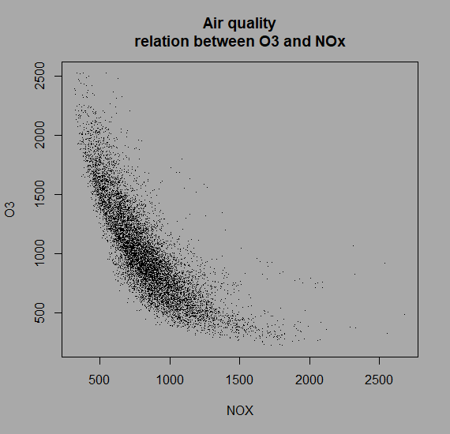

<!-- backgroundColor: darkgrey -->
<!-- headingDivider: 2 -->
<!-- paginate: true -->

<style> 
h1 {
    color:black;
}

h2 {
    margin-bottom: 50px;
}

section table{
    table-layout: fixed;
    width:100%;
    display: table;
    border: 0;
}

table {
    margin-bottom: 50px;
}

section table th, section table td, thead tr, tbody tr {
    background-color: darkgrey;
    border: 0;
    font-size: 30px;
    text-align: center;
}

.term {
    border-bottom: 1px dotted #000;
}

details {
    font-size: .8em;
}

summary {
    font-size: 1.4em;
}

details[open] summary ~ * {
  animation: sweep .5s ease-in-out;
}

pre {
    background-color: #A1A2A2;
    border: 0;
}

@keyframes sweep {
  0%    {opacity: 0; margin-left: -10px}
  100%  {opacity: 1; margin-left: 0px}
}
</style>

# Demonstrate the difference between regression and machine learning in Python (_from scratch_)


Part II

David D'Haese

## During initial data view

With the data now being presented in a structured way, what would you recommend to do first:

<details><summary>Data cleaning</summary>

<span style='color:#DD0000'>Not yet!</span>
</details>

<details><summary>Understand the data</summary>

<span style='color:green'>Spend <i>at least</i> several minutes to view the data. Try to form a mental picture of the meaning of the variables. Now, revisit the <a href='https://archive.ics.uci.edu/ml/datasets/Air+Quality'>source</a> and read the information provided.</span></details>

<details><summary>Data filtering</summary>

<span style='color:#DD0000'>Not yet!</span>
</details>

## Understand the data

The following statement may help to explore and understand the data set. It provides insight into the data frame dimensions, the availability and the data types as interpreted by the `read_csv` method:

```python
>>> data_df.info(verbose=True)

<class 'pandas.core.frame.DataFrame'>
RangeIndex: 9357 entries, 0 to 9356
Data columns (total 17 columns):
 #   Column       Non-Null Count  Dtype  
---  ------       --------------  -----  
 0   Date         9357 non-null   object 
 […]
 16  Unnamed: 16  0 non-null      float64
dtypes: float64(2), int64(8), object(7)
memory usage: 986.9+ KB
```

## Capture meta-data

If your project is going to be distributed among several other people or if it is a larger project that will take several days or more to finish, then it is a good practise to describe the data and its source using a simple `json` format:

```json
{
  "title": "Diabetes Readmission Data Set",
  "description": "Clinical data of diabetes patients collected from 130 US hospitals during the period 1999-2008.",
  "data_set_type": ["Multivariate"],
  "instances_count": 101766,
  "publication_date": "2014-05-03",
  "origin_contact_email": [
    "John Clore <jclore@vcu.edu>",
    [...]
  ],
  "outcome": "Readmission",
  "outcome_type": "Categorical",
  "feature_type": "Mixed",
  "feature_count": 36,
  "variable_descriptions": {
    "Race": "Nominal variable indicating the race of the patient",
    "Gender": "Gender of the patient",
[...]
```

## Following first glance

Now that we have glanced at the data, we need to go back to the original problem statement. In most other situations, we would need to explore which variables to include and which to exclude from the <span class='term' title='A subset of the original data set continaing only the variables that related to the problem statement'>analysis dataset</span>. In our current situation, where we endeavour to reproduce the scatter plot we saw before, we need to extract __O3__ (as <span class='term' title='Typically, the Y of the equation and the vertical axis of a plot'>outcome</span>) and __NOx__ (as <span class='term' title='Typically, the horizontal axis of a plot (for 2D plots)or the right-hand terms of the equation'>feature</span>)



## Extracting outcome and features

Extracting serves to focus on the relevant data. You may have noticed that some of the features would require cleaning (e.g. `Date` in non-standard format, `T` and `RH` with the comma as decimal separator, empty columns, …) and the point of this filtering operation serves exactly to avoid the cleaning of variables that would serve no purpose in the further analysis.

## Selecting a column (I)

Which is the proper way to _extract_ one variable from a pandas data frame (_try it out and then answer_):

<details><summary>A</summary>

<span style='color:green'>This is the more generic way to extract one variable from a data frame. It always works.</span>
</details>

```python
feat = data_df [ "NOx" ]
```

<details><summary>B</summary>

<span style='color:green'>This can also work to extract a variable, but something doesn't.</span>
</details>

```python
feat = data_df.NOx
```

<details><summary>C</summary>

<span style='color:#DD0000'>This is the proper way to reduce a data frame to a one-column data frame, but it does not _extract_ it as a `pandas.core.series.Series` object. Use <code>type (<span class='term' title='This dot is a placeholder for a python expression'>·</span>)</code> to investigate this further.</span>
</details>

```python
feat = data_df.[[ "NOx" ]]
```

## Selecting a column (II)

```python
feat = data_df [ "NOx" ]
feat = data_df.NOx
```

In what situation do you think the second option __does not__ work to extract a column (_explain in your own words_):

<input/>

<br><details><summary>Check</summary>

Whenever the name of the data set variable (here, _NOx_) is not a [valid python variable](https://www.w3schools.com/python/python_variables.asp). Hence, we need to strive to renaming the headers of our data set to match the validity in Python (and most other programming languages).

</details>

## Data frames and data series

Data frames are augmented version of <span class='term' title='A python package for scientific computing'>`numpy`</span> matrices and `pandas` data series are to data frames what arrays are to matrices.

```python
arr = [ 1, 2, 3, 4, 5, 6 ]
mat = [[ 1, 2, 3 ], [ 4, 5, 6 ]]
```

Now, you understand where the single and double square bracket notation comes from:

```python
dat_series = data_df [ "NOx" ]
dat_frame = data_df [[ "NOx" ]]
```

Use the `type (·)` to check the object structure of those python variables.

## Data types of O3 and NOx variables

Use the `info` method described above to check the data types of our two main variables:

<details><summary>Object</summary>

</details>

<details><summary>float64</summary>

</details>

<details><summary>int64</summary>

</details><br>

> Note that the `info` method also allows for the calculation of the number of missing values.

<!-- _class: lead -->

## Describing the data

While this step is normally more important then it is here, we will here only demonstrate the use of the `describe` method on a data frame or data series object. In typical circumstances, we would use this information (and more) to evaluate the reliability of the features and the outcome.

```python
>>> outc.describe()
O3
count	9357.000000
mean	975.072032
std 	456.938184
min 	-200.000000
25% 	700.000000
50% 	942.000000
75% 	1255.000000
max 	2523.000000
```

## Recreating the scatter

Run this code and make sure you get a similar output:

```python
import matplotlib.pyplot as plt

fig, ax = plt.subplots ( figsize = (6, 5))
ax.set_aspect('equal', 'datalim')
ax.scatter(feat, outc, color="black", marker=".", s=2)
ax.set_title('O3 vs NOx')
ax.set_xlabel("NOx", labelpad =20)
ax.set_ylabel("O3", labelpad =20)
plt.show()
```

Note that it uses a new module that you will need to install upon first use.


## Understanding plotting (I)

There is no easy way to learn how to plot using `matplotlib`. Instead, we suggest that for every line of the above code you 1. write down what you think it means, 2. Google for it and then, if your knowledge increased, 3. write again what you think it does:

```python
fig, ax = plt.subplots ( figsize = (6, 5))
```

First thoughts:

<textarea cols="137" rows="4"></textarea>

After Googling for it:

<textarea cols="137" rows="4"></textarea>

## Understanding plotting (II)

```python
fig, ax = plt.subplots ( figsize = (6, 5))
```

Why do you think there are round brackets surrounding the numbers 6 and 5?

<details><summary>To make clear that the figure size is 6.5 and to allow for comma separator</summary>

</details>

<details><summary>Because the figure size is being presented as an array representing width and height (in inches)</summary>

</details>

<details><summary>Because the figure size is being presented as a list</summary>

</details>

<details><summary>None of the above</summary>


<span style='color:green'>The round brackets indicate a [tuple](https://www.w3schools.com/python/python_tuples.asp). Tuples also allow for automatically unpacking the output of a function into multiple variables as you can see at the start of the statement.</span>

</details>

## Understanding plotting (III)

What does this function do?

```python
ax.set_aspect('equal', 'datalim')
```

First thoughts:

<input value="It set the ..."/>

After Googling for it:

<input />

## Understanding plotting (IV)

This statement obviously draws the plot:

```python
ax.scatter(feat, outc, color="black", marker=".", s=2)
```

What does the `s` stand for and in what units is the `2`?

<input />

What is the philosophy behind the usage of axes? (_first thought_)

<input />

What is the philosophy behind the usage of axes? (_after reading [this article](http://jonathansoma.com/lede/algorithms-2017/classes/fuzziness-matplotlib/how-pandas-uses-matplotlib-plus-figures-axes-and-subplots/)_)

<input />

The other plot statements should be clear.

## Milestone 2

Congratulations, you have arrived<br>at your second milestone!


<br><br>

[I am ready to go to Part III](Regress_ML_3.html#1)
