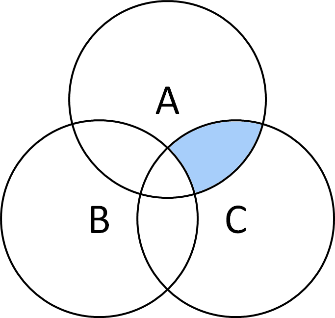
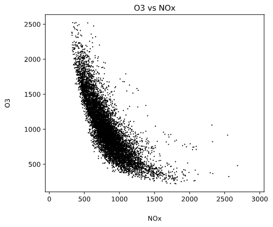
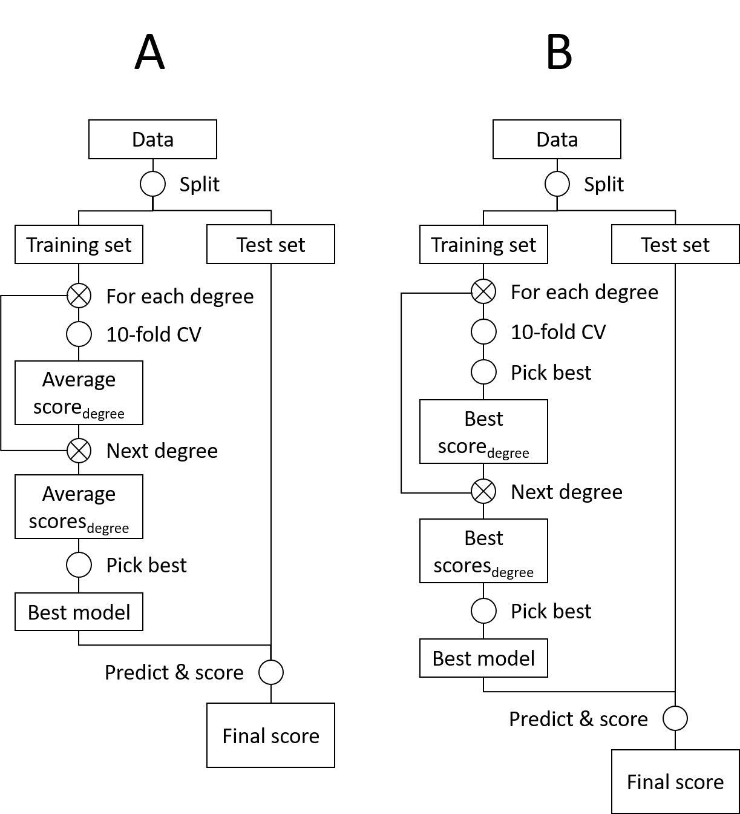
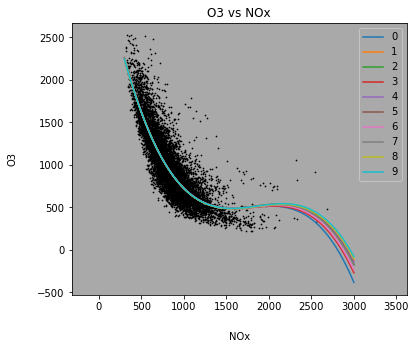
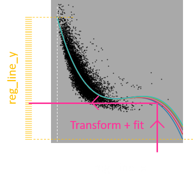
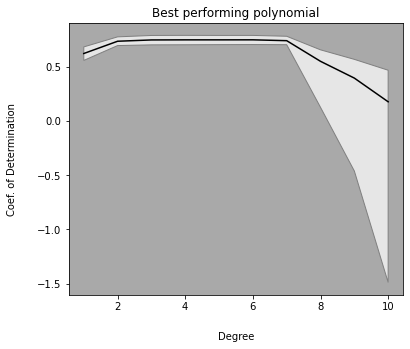
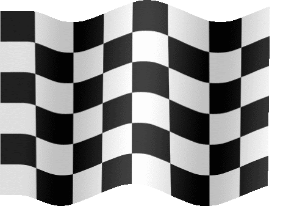

<!-- backgroundColor: darkgrey -->
<!-- headingDivider: 2 -->
<!-- paginate: true -->

<style> 
h1 {
    color:black;
}

h2 {
    margin-bottom: 50px;
}

section table{
    table-layout: fixed;
    width:100%;
    display: table;
    border: 0;
}

table {
    margin-bottom: 50px;
}

section table th, section table td, thead tr, tbody tr {
    background-color: darkgrey;
    border: 0;
    font-size: 30px;
    text-align: center;
}

.term {
    border-bottom: 1px dotted #000;
}

details {
    font-size: .8em;
}

summary {
    font-size: 1.4em;
}

details[open] summary ~ * {
  animation: sweep .5s ease-in-out;
}

pre {
    background-color: #A1A2A2;
    border: 0;
}

.term[tip]:hover:after {
  content: attr(tip);
  position: absolute;
  color:black;
  background-color: darkgrey;
  border: 1px solid black;
  width: 400px;
  border-radius: 10px;
  padding: 10px;
  font-size: .7em;
}

@keyframes sweep {
  0%    {opacity: 0; margin-left: -10px}
  100%  {opacity: 1; margin-left: 0px}
}
</style>

# Demonstrate the difference between regression and machine learning in Python (_from scratch_)


Part III

David D'Haese

## Outliers


This graph is where we ended last time. Have you noticed the dot in the lower left corner of this graph? What are correct statements concerning this dot:

<details><summary>This dot represents an outlier and this value should be removed</summary>


<span style='color:#DD0000'>You do not really know whether the dot represents one or more _instances_ at this point</span>

</details>

<details><summary>In the strict statistical sense, there are no outliers</summary>


<span style='color:green'>That is true, it is the realm of science to make sure that the _data sample_ is reliable and representative for the _population_. However, common sense dictates that negative values for concentration of these gases is not possible, so these values ought to be removed.</span>

</details>

## Impact of removing outliers

Guess which code block is the correct way to check the impact of the outlier removal:

<details><summary>A</summary>

<span style='color:#DD0000'>Python's <i>and</i>, <i>or</i> and <i>not</i> logical operators are designed to work with scalars, not with container types such as arrays or data series.</span>
</details>

```python
data_df_neg = data_df [(data_df.NOx < 0) or (data_df.O3 < 0 )]
f"{data_df_neg.shape [ 0 ] / data_df.shape [ 0 ]:.2%} of the data is lost."
```

<details><summary>B</summary>

<span style='color:green'>Yeah! Pandas provides a <span class='term' title='Element-wise'>vectorized</span> version of the bitwise logical operators.</span>
</details>

```python
data_df_neg = data_df [(data_df.NOx < 0) | (data_df.O3 < 0 )]
f"{data_df_neg.shape [ 0 ] / data_df.shape [ 0 ]:.2%} of the data is lost."
```

<details><summary>C</summary>


<span style='color:#DD0000'>Visually, we see that all negative NOx values arealso negative for O3, but what a next data update might be different. Therefor, we need to take both variables into account. Also, the `.2%` syntax in the f-string is better than the `.2f` syntax because it fits the idea that a percentage is a format rather than a tranformation.</span>

</details>

```python
data_df_neg = data_df [[(data_df.NOx < 0)]]
f"{100 * data_df_neg.shape [ 0 ] / data_df.shape [ 0 ]:.2f} % of the data is lost."
```

## Boolean masks I

A boolean mask is applying an array-like list of boolean values to a pandas data frame in order to select _instances_ where the values of the mask evaluate to `True`. How would you select the instances that correspond to the shaded area in this Venn diagram?



<details><summary><code>df [A & C & !B]</code></summary>

</details>

<details><summary><code>df [( A & C ) & !B]</code></summary>

</details>

<details><summary><code>df [A & C & ~B]</code></summary>

</details>

## Boolean masks II

Given the statement `df [A]`, how would `A` most probably be pre-defined:

<details><summary><code>A = df.Quality_Class == "Premium"</code></summary>

</details>

<details><summary><code>A = df.Quality_Class = "Premium"</code></summary>

</details>

<details><summary><code>A = df.Quality_Class</code></summary>

</details>

<details><summary><code>A = "Premium"</code></summary>

</details>

## Outliers removed

Finally, using this code:

```python
data_df_noneg = data_df [(data_df.NOx >= 0) | (data_df.O3 >= 0 )]
```

,you should be able to reproduce the same plot as before, but now with the negative points removed.



<details><summary>Help, it doesn't work</summary>

Have you thought of renaming the variables for splitting the data set:

```python
outc = data_df_noneg [[ "O3" ]]
feat = data_df_noneg.NOx
```

</details>

## Peek preview

Before we start fitting a polynomial, we need to randomize the data into a training set and a test set (see [earlier info](Regress_ML_1.html#14) on this). At the time, we did not bother but we actually made a serious mistake, what was it?

<details><summary>We requested `info()`</summary>

<span style='color:#DD0000'>With info we saw just some general statistics about the shape of the data frame and the types of the data series.</span>
</details>

<details><summary>We have splitted the data into outcome and features before randomization</summary>

<span style='color:#DD0000'>No, that shouldn't matter.</span>
</details>

<details><summary>We have looked at the plot containing test data</summary>

<span style='color:green'>Correct, although the impact might be low, it is good practise to hide the test data from sight as soon as possible.</span>
</details>

<details><summary>We have been adopting global cleaning rules before randomization</summary>


<span style='color:#DD0000'>If, based on the summary (e.g. from `info`) one decides to filter the data (e.g. for positive NOx and O3), _without_ observing the data point individually, then it is OK to do this before randomization.</span>
</details>

## Randomization

Here is the code to randomize the features and the outcome variable:

```python
feat_trai, feat_test, outc_trai, outc_test = train_test_split(
    feat, outc, test_size=0.33, random_state=42)
```

The first two unnamed arguments list the data frames we which to randomize. The `test_size` sets the approximate proportion of the number of test instances versus the total number of instances in the input data frames. Finally, the `random_state` guarantees that the randomization is <span class='term' tip='This means that the data is shuffled randomly before sampling but that anyone running this code will get the exact same outcome.'>reproducibly random</span>.

## Fitting a polynomial

Time to fit a polynomial to our data. Let us start by trying a third degree polynomial:

```python
polynomial_features= PolynomialFeatures(degree=3)
feat_poly = polynomial_features.fit_transform ( feat )

learner = LinearRegression()
learner.fit(feat_poly, outc)
```

Mind that this is a 2-step process:

1. Transform the data: $x_i → [1, x_i, x_i^2, x_i^3]$ (check `polynomial_features.get_feature_names()`)
2. Fit linear regression $f(x)=ax_i^3 + bx_i^2 + cx_i + d$, where $f(x)$ stands for `outc` and $x$ stands for `feat`

## Cross-validation I

The next step is to make a prediction using our polynomial model. However, as a reminder, the goal of machine learning is __not so much to fit the data itself__. Instead, the goal is to __accurately fit future data__ derived from the same process. Select the best strategy:


|<details><summary>A</summary></details>|<details><summary>B</summary></details>|
|-|-|




## Cross-validation II

Lookup about `cross validation` and how to go about it and then choose the appropriate function to use:

<details><summary><code>train_test_split()</code></summary>


<span style='color:#DD0000'>This is the function to be used for a one-time split of the data set into a training set and a test set, but it is not the appropriate function for a cross validation where multiple consecutive splits are neede allong the instances-axis.</span>
</details>

<details><summary><code>cross_val_score()</code></summary>


<span style='color:green'>Not as versatile as `cross_validate()`, but it does the job. See [this post](https://datascience.stackexchange.com/questions/28441/what-is-the-difference-between-cross-validate-and-cross-val-score) for more info.</span>
</details>

<details><summary><code>cross_validate()</code></summary>


<span style='color:green'>Is a versatile way to perform a cross validation. It is easier to start of using `cross_val_score ()`, however. See [this post](https://datascience.stackexchange.com/questions/28441/what-is-the-difference-between-cross-validate-and-cross-val-score) for more info.</span>
</details>

<details><summary>I don't know</summary>

Remember to Google for  `cross validation sklearn` and the first hit will be the right one.

</details>

## Cross-validation III

Quick recap. We first decide to split our data set into a training set and a test set and after that we use the training set to execute the cross-validation. This is how your code should look like this, by now:

```python
feat_trai, feat_test, outc_trai, outc_test = train_test_split(
    feat, outc, test_size=0.33, random_state=42)
    
polynomial_features= PolynomialFeatures(degree=3)
feat_poly = polynomial_features.fit_transform ( feat_trai )

learner = LinearRegression()
cross_val_score(learner, feat_poly, outc_trai, cv=10)
```

## Cross-validation IV

Running the previous code ending with the `cross_val_score()` function, you should get this:

```txt
array([0.73303171, 0.77451942, 0.76198691, 0.70205498, 0.7528688 ,
       0.7888097 , 0.7647057 , 0.72365955, 0.71991253, 0.79417301])
```

What do these numbers mean?

<details><summary>I really do not know.</summary>

_Don't be a loser and read the skLearn article on [`cross_val_score()`](https://scikit-learn.org/stable/modules/generated/sklearn.model_selection.cross_val_score.html?highlight=cross_val_score#sklearn.model_selection.cross_val_score)._

</details>

<details><summary>These are the correlation coefficients resulting from the 10 folds in the CV</summary>

<span style='color:#DD0000'>Not correlation coefficients, read [this small article](https://blog.uwgb.edu/bansalg/statistics-data-analytics/linear-regression/what-is-the-difference-between-coefficient-of-determination-and-coefficient-of-correlation/)</span>
</details>

<details><summary>These are the coefficients of determination for the 10 folds in the CV</summary>


<span style='color:green'>Correct, these numbers are in the range $[-\infty, 1]$ and represents the proportion of variance in `outc` that is predictable from the transformed features in `feat_poly`, and this for each fold in the CV. See [this article](https://en.wikipedia.org/wiki/Coefficient_of_determination) and [this one](https://scikit-learn.org/stable/modules/model_evaluation.html#r2-score-the-coefficient-of-determination) for more info.</span>
</details>

## Visualizing the cross validation I

To demonstrate the effect of the separate fits during the CV, execute this code:

```python
reg_line_x = np.linspace ( 300, 3000, 100 )
reg_line_x_poly = poly_transform.fit_transform ( np.reshape( reg_line_x, (-1, 1)))

fig, ax = plt.subplots ( figsize = (6, 5))
ax.set_aspect('equal', 'datalim')
ax.scatter(feat, outc, color="black", marker=".", s=2)
ax.set_title('O3 vs NOx')
ax.set_xlabel("NOx", labelpad =20)
ax.set_ylabel("O3", labelpad =20)

for k, (fold_trai, fold_test) in enumerate(KFold(10).split(feat_poly, outc_trai)):
    learner.fit(feat_poly[fold_trai, :], outc_trai.iloc[fold_trai])
    reg_line_y = learner.predict ( reg_line_x_poly )
    ax.plot(reg_line_x, reg_line_y, label=str(k))

ax.legend()
plt.show()
```

## Visualizing the cross validation II

You should get this result. The legend represents the fold index (not the degree, the degree is fixed to 3, here).



## Visualizing the cross validation III

In the previous code, we use the `linspace` method of the `numpy` module to create an 'artificial' axis (`reg_line_x`). During each fold, we then transformed this axis and predicted `reg_line_y` using the learner that was trained on that fold's training sub set.



## Visualizing the cross validation IV

What is the purpose of this statement:

```python
np.linspace ( 300, 3000, 100 )
```

<details><summary>Generate an sequence of 100 numbers going from 300 to 3000</summary>

</details>

<details><summary>Generate the sequence 300, 400, .., 2900, 3000</summary>

</details>

<details><summary>Generate a random <i>n</i>-normed linear space in the range [300, 3000] as described <a href="http://emis.impa.br/EMIS/journals/IJOPCM/Vol/09/IJOPCM(vol.2.3.13.S.9).pdf">here</a></summary>

<span style='color:#DD0000'> Fooled you!</span>
</details>

## Visualizing the cross validation V

What is the purpose of this statement:

```python
np.reshape( reg_line_x, (-1, 1))
```

<details><summary>To make sure that the values in <code>reg_line_x</code> reside in the range [-1, 1]</summary>

<span style='color:#DD0000'>This does not make any sense, think about it. Why would we want to do that?</span>
</details>

<details><summary>To turn <code>reg_line_x</code> into one long row of numbers</summary>


<span style='color:#DD0000'>No, `reg_line_x` already is one long row.</span>

</details>

<details><summary>To turn <code>reg_line_x</code> into a one-column matrix.</summary>


<span style='color:green'>Absolutely correct, try the statement `(np.reshape( reg_line_x, (-1, 1))).shape` to confirm.</span>

</details>

<details><summary>To turn <code>reg_line_x</code> into a one-column data frame</summary>


<span style='color:#DD0000'>No, the `numpy` module to which `np` refers does not handle data frames at all. It is the `pandas` module, and modules derived from it, that do this.</span>

</details>

## Visualizing the cross validation VI

```python
for k, (fold_trai, fold_test) in enumerate(KFold(10).split(feat_poly, outc_trai)):
    pass
```

In this code block, the `enumerate` function presents the items of a list one by one. In this case, it provides, during each iteration, three values: `k`, `fold_trai`, and `fold_test`. Based on this code, what is the structure of one item the enumerator presents every iteration: __A.__ a list, __B.__ a tuple inside a tuple, __C.__ a list inside a list, __D.__ an array inside an array, or __E.__ a tuple inside a list? [Check your answer here](#20)

[Next →](#21)

## Visualizing the cross validation VII

It is important that you understand Python's basic data structure, so best to check for yourself using the following statement:

```python
A = 1, (2, 3); print(type(A), type(A[1]))
```

[←Go back](#19)

## Choosing the best polynomial

We can now do the above analysis for each degree in the range [1, 10] and remember the mean ± 95% confidence interval (CI):

```python
score_cv_means = []
score_cv_lowvs = []
score_cv_highs = []

for degree in range(1, 11):
    poly_transform = PolynomialFeatures(degree=degree)
    feat_poly = poly_transform.fit_transform ( feat_trai )
    
    scores_degree = cross_val_score(learner, feat_poly, outc_trai, cv=10)
    score_cv_means.append(np.mean(scores_degree))
    score_cv_lowvs.append(np.percentile(scores_degree, 2.5))
    score_cv_highs.append(np.percentile(scores_degree, 97.5))
```

## The result we have been waiting for I

With this single line of code we can now pretty-print the mean score for each degree:

```python
[f"Score {i+1}: {score:.3f}" for i, score in enumerate ( score_cv_means )]
```

You should get his:

```txt
['Score 1: 0.626',
 'Score 2: 0.740',
 'Score 3: 0.752',
 'Score 4: 0.752',
 'Score 5: 0.752',
 'Score 6: 0.753',
 'Score 7: 0.745',
 'Score 8: 0.554',
 'Score 9: 0.399',
 'Score 10: 0.180']
 ```

## The result we have been waiting for II

We can also plot the result and add the 95% CI band:

```python
fig, ax = plt.subplots ( figsize = (6, 5))
bg_col = (169/255,169/255,169/255)
ax.set_facecolor (bg_col)
ax.plot(range(1, 11), score_cv_means, color="black", label="score")

ci_band = [*zip(list(range(1, 11)) + list(range(10, 0, -1)),
                score_cv_lowvs + list(reversed(score_cv_highs)))]
poly = Polygon(ci_band, facecolor='0.9', edgecolor='0.5')
ax.add_patch(poly)
ax.set_title('Best performing polynomial')
ax.set_xlabel("Degree", labelpad =20)
ax.set_ylabel("Coef. of Determination", labelpad =20)
plt.show()
```



## The result we have been waiting for III

We see that a polynomial of degree 3, 4, 5, and 6 generates about the same score. With 1 or 2 degrees, the score is considerably worse (__underfit__) as well as for degrees above 6 (__overfit__).


## Finish

Congratulations, you have proven that machine learning can do what a simple regression cannot!

You have hereby arrived at the finish!


